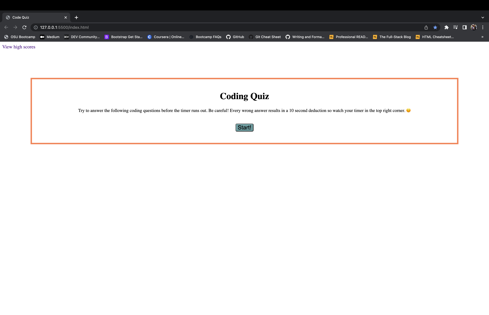
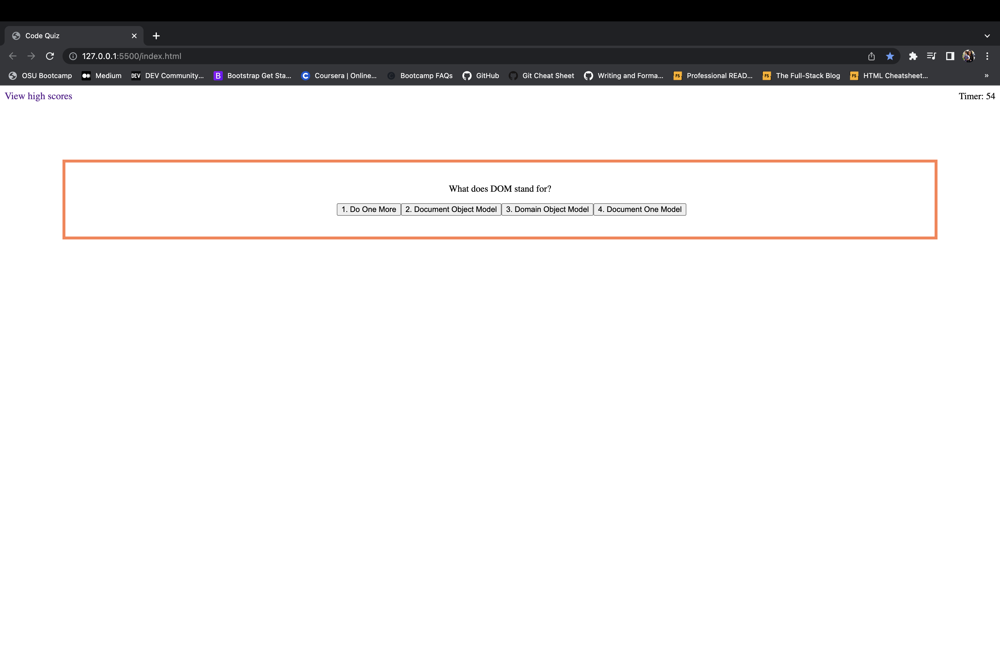
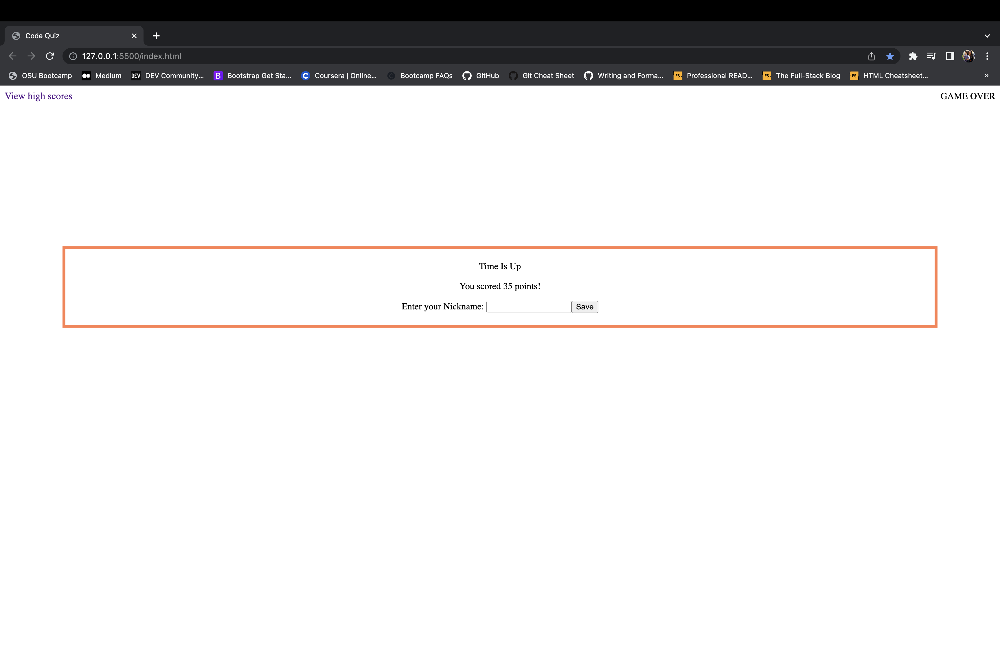
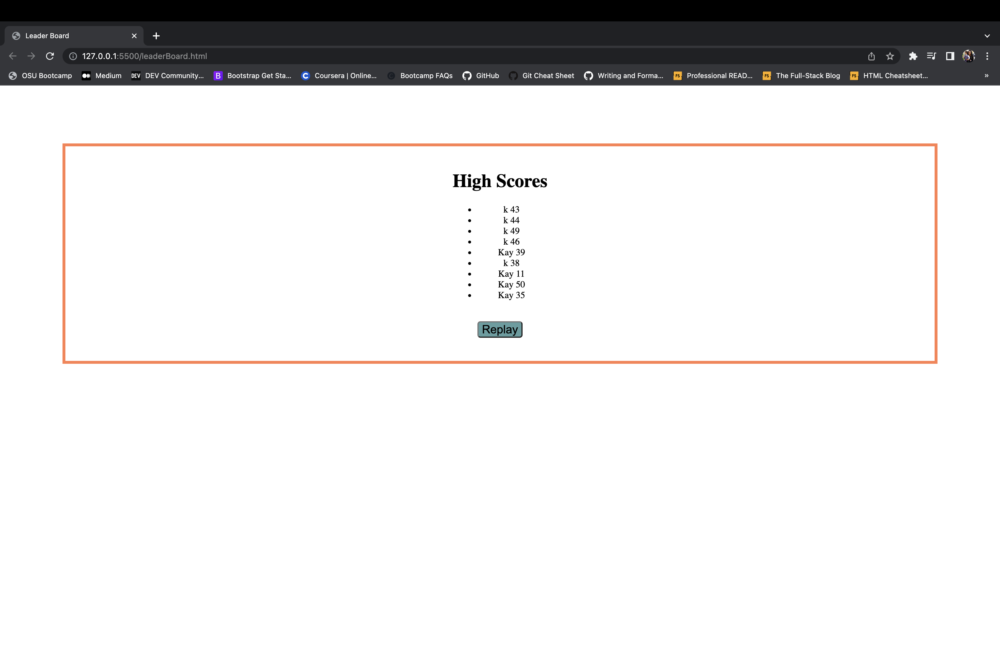

# Code Quiz

## Description
This application was made to test your knowledge of JavaScript. This quiz is timed and each second left counts as a point, with wrong answers resulting in a 5 second (or point) deduction. Each final score is saved in a leaderboard so you can track your progress as well as compete with others. 

## Installation

N/A

## Usage

After the start button is clicked, questions will appear and the timer starts. Select your answer by clicking the button. A box below will reveal if each answer was correct or incorrect. After completion of questions, or if the timer reaches 0, you will be given your final score and the ability to enter a nickname and save it to the leaderboard. You can also click the "View high scores" link in the top left to view the leaderboard. The leaderboard also features a button be able to replay the quiz.

 https://kaylanorris.github.io/code0quiz/

## License

Please refer to the license in the REPO.